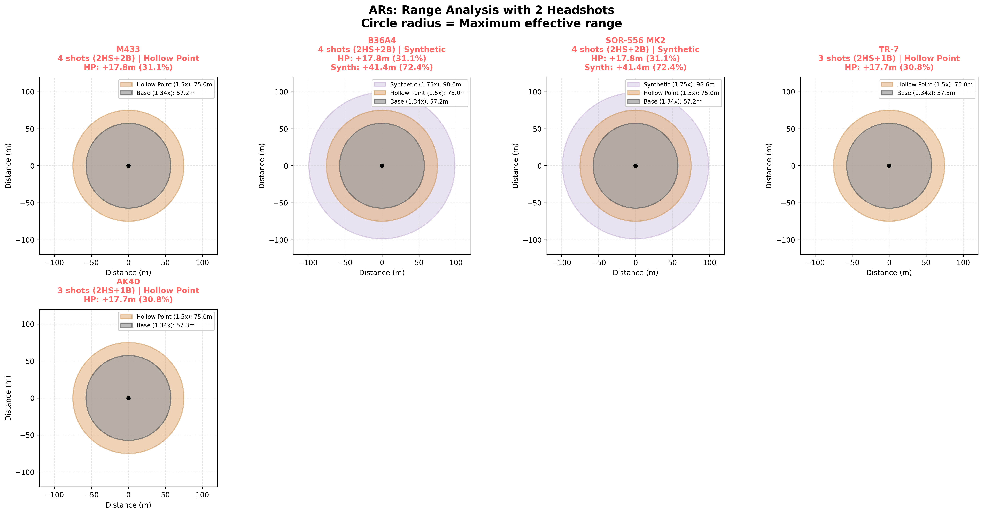
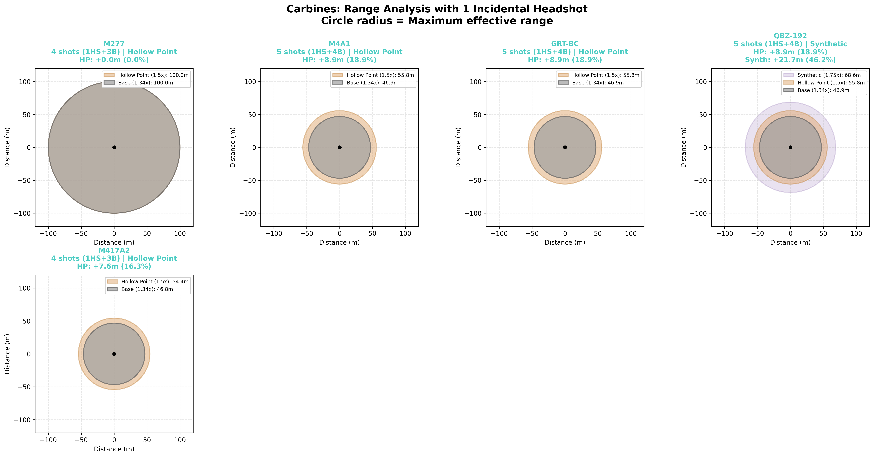
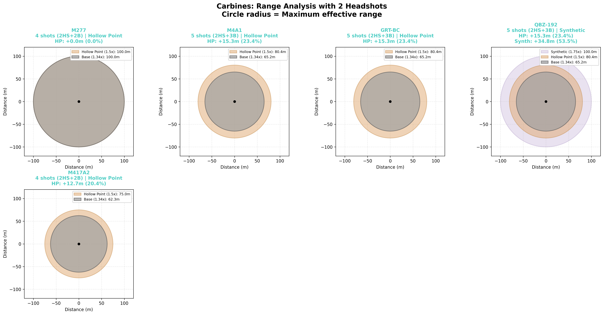
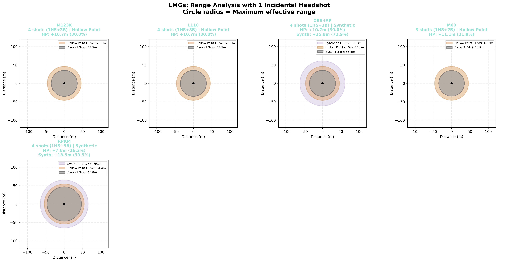
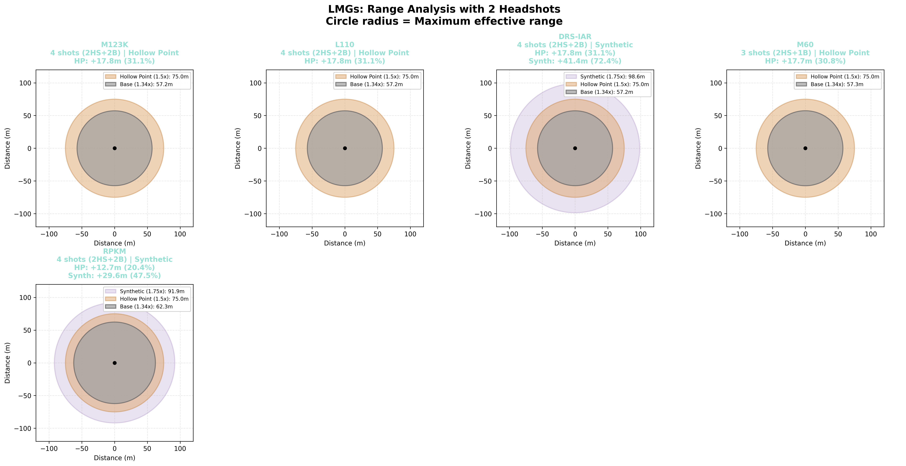
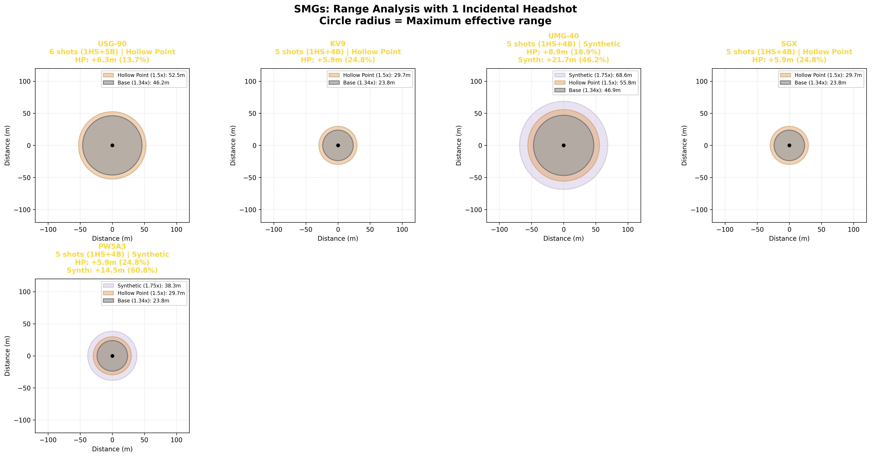
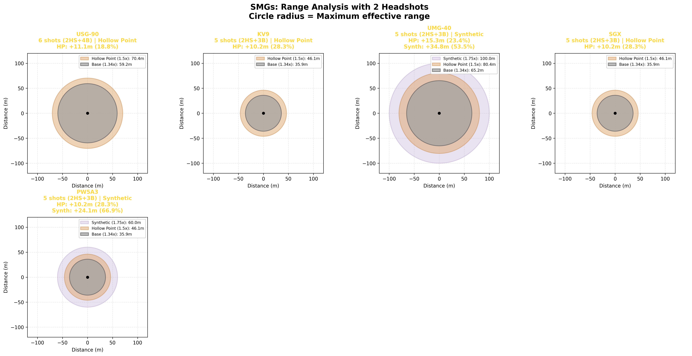
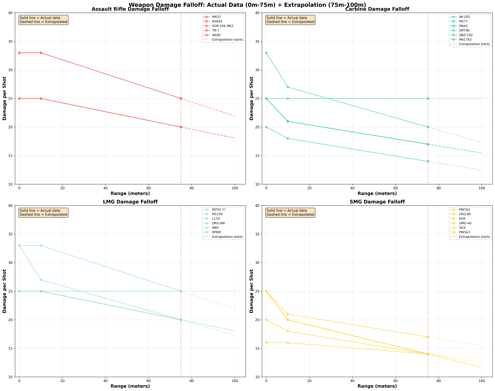

# Battlefield 6 Weapon Range Analysis

A comprehensive analysis of weapon effective ranges in Battlefield 6, comparing base ammunition, Hollow Point (HP), and Synthetic ammo types across different headshot scenarios.

## Overview

This project analyzes how special ammunition (Hollow Point and Synthetic) extends weapon effective range by increasing headshot damage multipliers:
- **Base Ammo**: 1.34x headshot multiplier
- **Hollow Point**: 1.5x headshot multiplier  
- **Synthetic**: 1.75x headshot multiplier

The analysis uses actual weapon damage data at 0m, 10m, 75m, and extrapolates to 100m to calculate maximum effective kill ranges assuming 100 HP targets.

## Key Findings

### Special Ammo Benefits
- **2 Headshot scenarios show massive gains**: +30-40m range extensions with Synthetic ammo
- **1 Incidental headshot scenarios**: More modest but still significant +10-25m extensions
- **Weapon-specific availability**: Not all weapons have access to Synthetic ammo

### Top Performers
- **M277 Carbine**: Zero damage falloff out to 100m with all ammo types
- **High-damage ARs/LMGs**: Can reach 90-100m with Synthetic and 2 headshots
- **Carbines**: Several reach 100m with Synthetic and 2 headshots (M4A1, GRT-BC, QBZ-192, UMG-40)

---

## Visualizations by Weapon Class

These visualizations group weapons by class (AR, Carbine, LMG, SMG) and show how different headshot scenarios affect effective range.

### Assault Rifles

#### 1 Incidental Headshot

**Key Insights:**
- 3-shot kill weapons (TR-7, AK4D): 35m base → 62m synthetic (+76%)
- 4-shot kill weapons: 35-36m base → 61-62m synthetic (+73%)

#### 2 Headshots

**Key Insights:**
- All ARs reach 75m+ with HP ammo
- Synthetic extends to 97-99m - nearly double the base range!
- 3-shot kills slightly outperform 4-shot kills at extreme ranges

---

### Carbines

#### 1 Incidental Headshot

**Key Insights:**
- **M277 dominates**: 100m at all ammo types (zero falloff!)
- 5-shot carbines: 47m base → 69m synthetic (+47%)
- M417A2: 47m base → 65m synthetic (+39%)

#### 2 Headshots

**Key Insights:**
- **M4A1, GRT-BC, QBZ-192**: Reach 100m with Synthetic (+53%)
- M277 maintains 100m dominance
- Best overall range performance of any weapon class

---

### Light Machine Guns (LMGs)

#### 1 Incidental Headshot

**Key Insights:**
- Similar performance to ARs in this scenario
- M60 matches high-damage AR performance (35m → 62m)
- RPKM slightly better: 47m base → 65m synthetic

#### 2 Headshots

**Key Insights:**
- Excellent long-range performance with 2 headshots
- Most LMGs reach 75m with HP, 90-99m with Synthetic
- Consistent +31-47% range improvement with HP

---

### Submachine Guns (SMGs)

#### 1 Incidental Headshot

**Key Insights:**
- **Clear performance gap**: KV9/SGX limited to 24-38m
- **UMG-40 exceptional**: 47m base → 69m synthetic (matches carbines!)
- Most SMGs suffer from steep damage falloff

#### 2 Headshots

**Key Insights:**
- **UMG-40 reaches 100m** with Synthetic - exceptional for an SMG
- USG-90 solid mid-range: 59m base → 86m synthetic (+45%)
- Low-damage SMGs still limited to 60m even with Synthetic

---

## Visualizations by Bullets-To-Kill (BTK)

These visualizations group weapons by how many shots they need to kill at 20m with standard ammo and 1 headshot.

### 3-Shot Kill Weapons

#### 1 Incidental Headshot + 2 Body Shots

**Weapons:** TR-7, AK4D, M60 (all Hollow Point)
- Base: 34.9m
- Hollow Point: 46.0m (+32%)
- Theoretical Synthetic: 61.5m (+76%)

#### 2 Headshots + 1 Body Shot

**Weapons:** TR-7, AK4D, M60
- Base: 57.3m  
- Hollow Point: 75.0m (+31%)
- Theoretical Synthetic: 97.6m (+70%)

**Analysis:** These high-damage weapons (33 DMG) benefit enormously from multiple headshots.

---

### 4-Shot Kill Weapons

#### 1 Incidental Headshot + 3 Body Shots

**Weapons:** M277, M123K, L110, DRS-IAR, M433, B36A4, SOR-556 MK2, M417A2, RPKM

**Key Performers:**
- **M277**: 100m at all ranges (no falloff)
- Most 25 DMG weapons: 35m → 61m synthetic (+73%)
- M417A2/RPKM: 47m → 65m synthetic (+39%)

#### 2 Headshots + 2 Body Shots

**Key Performers:**
- **M277**: Still 100m (unstoppable)
- Most weapons reach 75m with HP, 90-99m with Synthetic
- **72% range increase** with Synthetic for many weapons

---

### 5-Shot Kill Weapons

#### 1 Incidental Headshot + 4 Body Shots

**Weapons:** M4A1, GRT-BC, QBZ-192, KV9, UMG-40, SGX, PW5A3

**Performance Tiers:**
- **Tier 1** (Carbines/UMG-40): 47m → 69m synthetic (+46%)
- **Tier 2** (Low-damage SMGs): 24m → 38m synthetic (+61%)

#### 2 Headshots + 3 Body Shots

**Key Performers:**
- **M4A1, GRT-BC, QBZ-192, UMG-40**: 100m with Synthetic (+53%)
- UMG-40 proves SMGs can compete at long range with right setup
- Low-damage SMGs: 36m → 60m synthetic (+67%)

---

## Visualization Guide

### Circle Layering
- **Gray (innermost)**: Base ammo effective range
- **Orange (middle)**: Hollow Point ammo effective range  
- **Purple (outermost)**: Synthetic ammo effective range (only shown for weapons with access)
- **Black dot**: Player position

### Reading the Charts
- **Circle radius** = Maximum range where the weapon can secure a kill with the specified shot combination
- **Larger circles** are more transparent to allow visibility of all ranges
- **Percentage increases** show how much special ammo extends your effective range

### Important Notes
- All ranges assume **100 HP targets**
- Calculations use **linear interpolation** between measured damage points (0m, 10m, 75m, 100m extrapolated)
- "**Incidental headshot**" scenarios assume one headshot occurs naturally during the engagement
- Not all weapons have access to **Synthetic ammo** - some only have Hollow Point

---

## Weapon Ammo Types

### Hollow Point Only
**ARs:** TR7, AK4D, M433, NVO-228E  
**Carbines:** M277, M4A1, GRT-BC, M417 A2, SG 553R  
**LMGs:** M/60, M123K, M240L, M250, L110  
**SMGs:** KV9, SCW-10, SGX, USG-90

### Synthetic Access
**ARs:** B36A4, L85A3, SOR-556 MK2  
**Carbines:** QBZ, SOR-300SC  
**LMGs:** DRS-IAR, KTS100 MK8, RPKM  
**SMGs:** PM7A2, PW5A3, SL9, UMG-40

---

## Damage Falloff by Weapon Type

This graph shows the actual damage falloff for all weapon types from 0m to 75m, with linear extrapolation to 100m. Key observations:
- **M277 (Carbine)**: Zero falloff - maintains 25 damage at all ranges
- **High-damage weapons** (33 DMG): Drop to ~22 damage at 100m
- **SMGs**: Steepest falloff - some drop from 25 to ~12 damage at 100m
- **Solid lines**: Actual measured data (0m, 10m, 75m)
- **Dashed lines**: Extrapolated data (75m-100m)

---

## Methodology

### Data Sources
- Weapon damage values at 0m, 10m, 75m from official game data
- Headshot multipliers from stat card values
- Ammo type availability verified across multiple data sources

### Calculation Method
1. **Damage at each range**: Direct measurement + linear extrapolation to 100m
2. **Total damage calculation**: `(Headshot_Damage × Num_Headshots) + (Body_Damage × Num_Body_Shots)`
3. **Range interpolation**: Find exact range where total damage = 100 HP using linear interpolation between measurement points
4. **Ammo comparison**: Calculate for base (1.34x), HP (1.5x), and Synthetic (1.75x) multipliers

### Assumptions
- **100 HP target** (standard player health)
- **No armor** or damage reduction
- **Direct hits** (no limb modifiers)
- **Linear damage falloff** between measurement points
- **Consistent headshot placement** (not realistic but useful for comparison)

---

## Key Takeaways

### When to Use Hollow Point
- ✅ **Always beneficial** - Every weapon gets range extension
- ✅ **Best for inconsistent aim** - Still helps even with 1 headshot

### When to Use Synthetic
- ✅ **Maximum range** - Best extension for long-range engagements
- ✅ **2+ headshot scenarios** - Truly shines with good aim (70-100% range increase!)
- ✅ **Long-range weapons** - Compounds with already good base range
- ⚠️ **Not universally available** - Check your weapon's options

### Weapon Selection for Range
**Best Long-Range Primaries:**
1. **M277** - Literally no falloff to 100m
2. **TR-7, AK4D, M60** - 97-99m with Synthetic + 2 HS
3. **M4A1, GRT-BC, QBZ-192** - 100m with Synthetic + 2 HS
4. **UMG-40** - Best SMG option for range (100m with Synthetic + 2 HS)

**Best for Incidental Headshots:**
- Any 25 DMG weapon with Synthetic access gets 60-70m range
- M277 still dominates at 100m

---

## Files in This Repository

### Visualizations
- `visualizations/BY_CLASS/` - Organized by weapon class (AR, Carbine, LMG, SMG)
- `visualizations/BY_BTK/` - Organized by bullets-to-kill (3-shot, 4-shot, 5-shot)

### Data Files
- `data/` - Raw weapon statistics and damage falloff data
- `analysis_results/` - CSV files with detailed range analysis results for each weapon and scenario

### Scripts
- `visualize_by_weapon_class.py` - Generates class-based visualizations
- `visualize_all_shots_100m.py` - Generates BTK-based visualizations
- `visualize_damage_falloff.py` - Generates damage falloff comparison charts
- Other analysis and verification scripts

