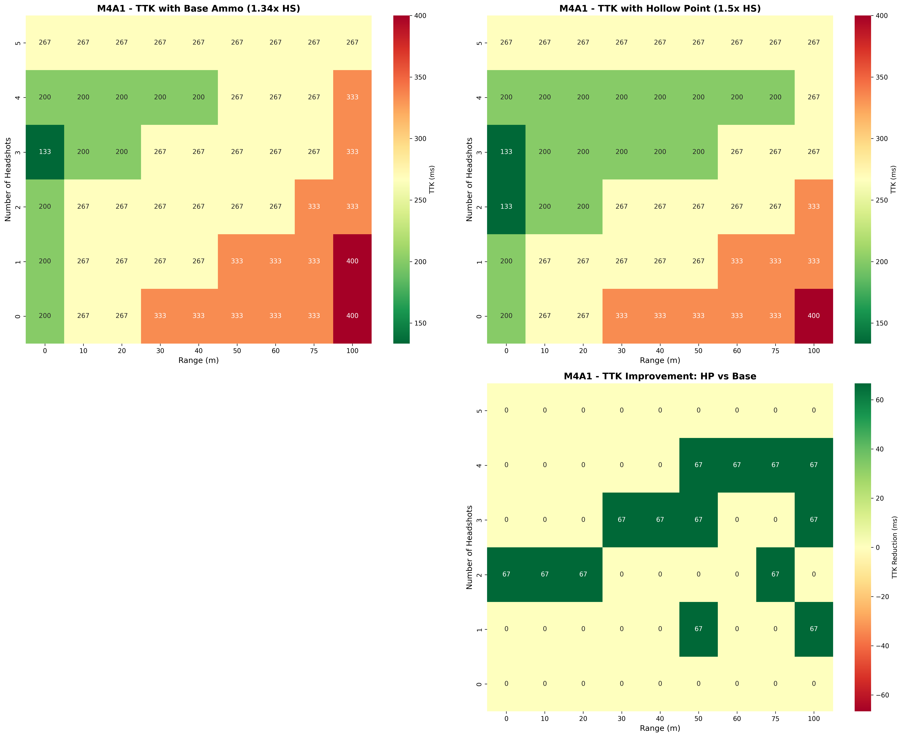
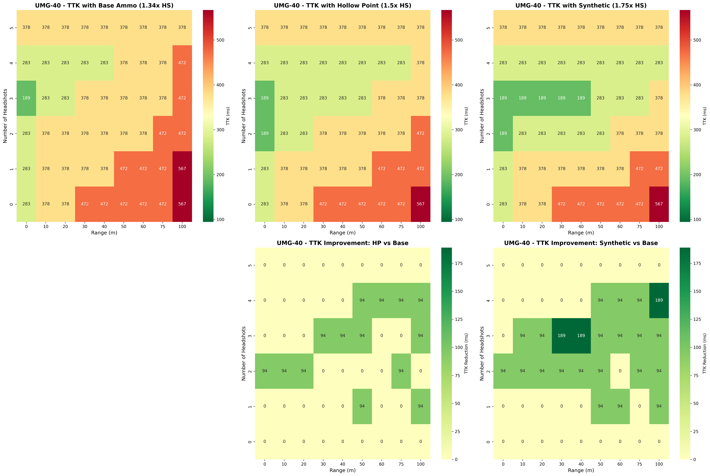
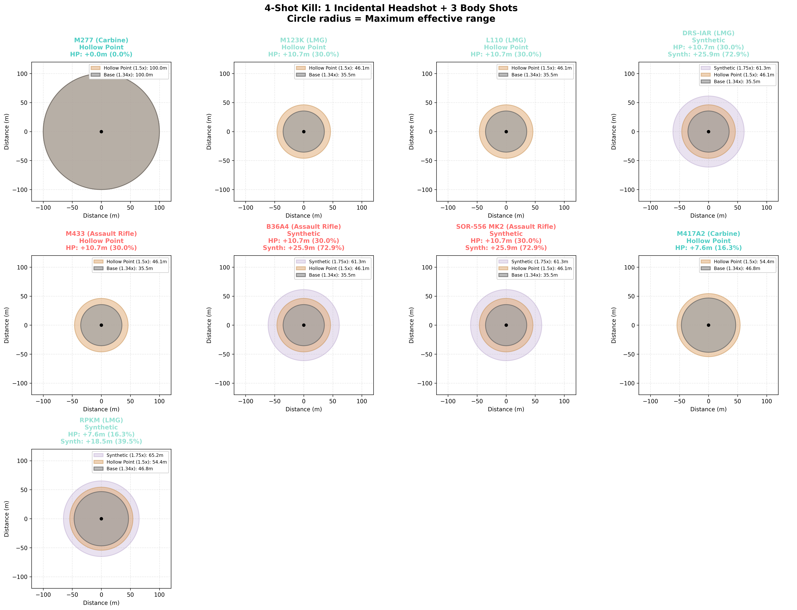
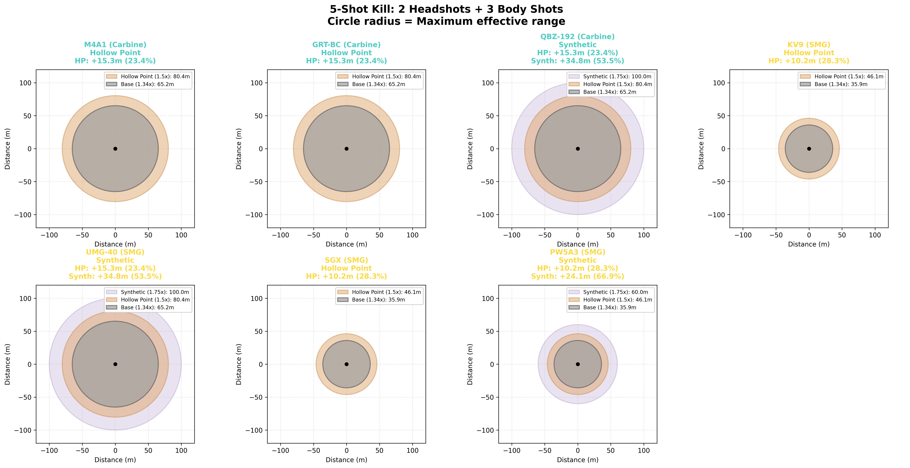

# Battlefield 6 Weapon Range Analysis

A comprehensive analysis of weapon effective ranges in Battlefield 6, comparing base ammunition, Hollow Point (HP), and Synthetic ammo types across different headshot scenarios.

## 🌐 Interactive Web Tool

**[View the Interactive Weapon Browser](https://orginalbusta.github.io/BF6-Ammo-Type-Analysis/)**

Browse all 16 weapons with detailed TTK analysis, range visualizations, and personalized ammo recommendations for each weapon!

## Overview

This project analyzes how special ammunition (Hollow Point and Synthetic) extends weapon effective range by increasing headshot damage multipliers:
- **Base Ammo**: 1.34x headshot multiplier
- **Hollow Point**: 1.5x headshot multiplier  
- **Synthetic**: 1.75x headshot multiplier

The analysis uses actual weapon damage data at 0m, 10m, 75m, and extrapolates to 100m to calculate maximum effective kill ranges assuming 100 HP targets.

## Key Findings

### Special Ammo Benefits
- **2 Headshot scenarios show massive gains**: +30-40m range extensions with Synthetic ammo
- **1 Incidental headshot scenarios**: More modest but still significant +10-25m extensions
- **Weapon-specific availability**: Not all weapons have access to Synthetic ammo

### Top Performers
- **M277 Carbine**: Zero damage falloff out to 100m with all ammo types
- **High-damage ARs/LMGs**: Can reach 90-100m with Synthetic and 2 headshots
- **Carbines**: Several reach 100m with Synthetic and 2 headshots (M4A1, GRT-BC, QBZ-192, UMG-40)

---

## TTK (Time-To-Kill) Analysis

Comprehensive weapon-by-weapon analysis showing how Hollow Point and Synthetic ammo affect TTK across different ranges and headshot combinations.

### Understanding the Analysis
Each weapon has a detailed TTK heatmap showing:
- **Top Row**: Actual TTK values (in milliseconds) for Base, HP, and Synthetic ammo
- **Bottom Row**: TTK improvements (how much faster HP/Synth kills vs Base)
- **Y-axis**: Number of headshots (0 at bottom = body shots only, increasing upward)
- **X-axis**: Range in meters
- **Color scale**: Shared across all plots for direct comparison

### Example: DRS-IAR (LMG with Synthetic Access)

**Key Insights:**
- 2 headshots at close range: HP/Synth both save 78ms (4-shot → 3-shot kill)
- 3 headshots at 50-75m: Synthetic saves 78ms consistently
- Maximum TTK improvement: 78ms across multiple scenarios

### Example: M4A1 (Carbine with HP Only)

**Key Insights:**
- 2 headshots at 0-20m: HP saves 67ms (5-shot → 4-shot kill)
- 1 headshot at 50m+: HP starts providing consistent 67ms improvement
- Demonstrates value even without Synthetic access

### Example: UMG-40 (SMG with Synthetic - Tierlist #2)

**Key Insights:**
- Shows exceptional Synthetic scaling (max 189ms improvement!)
- 2 headshots at 0-30m: Massive improvements from special ammo
- Best SMG for special ammo utilization

### Full TTK Analysis Library
All TTK analyses organized by weapon class:
- [Assault Rifles](visualizations/TTK_ANALYSIS/Assault%20Rifle/) - AK4D, B36A4, M433, SOR-556 MK2
- [Carbines](visualizations/TTK_ANALYSIS/Carbine/) - GRT-BC, M277, M4A1
- [Light Machine Guns](visualizations/TTK_ANALYSIS/LMG/) - DRS-IAR, L110, M123K, RPKM
- [Submachine Guns](visualizations/TTK_ANALYSIS/SMG/) - KV9, PW5A3, SGX, UMG-40, USG-90

### Ammo Type Tierlists

#### Top Hollow Point Users
Based on average TTK improvement across all ranges and headshot combinations:

| Rank | Weapon | Class | Avg Improvement | Max Improvement |
|------|--------|-------|-----------------|-----------------|
| 1 | AK4D | Assault Rifle | 116.7ms | 116.7ms |
| 2 | RPKM | LMG | 108.5ms | 108.5ms |
| 3 | SOR-556 MK2 | Assault Rifle | 105.6ms | 105.6ms |
| 4 | UMG-40 | SMG | 94.5ms | 94.5ms |
| 5 | M277 | Carbine | 83.3ms | 83.3ms |
| 6 | L110 | LMG | 83.3ms | 83.3ms |
| 7 | B36A4 | Assault Rifle | 83.3ms | 83.3ms |
| 8 | DRS-IAR | LMG | 77.8ms | 77.8ms |
| 9 | PW5A3 | SMG | 77.8ms | 77.8ms |
| 10 | GRT-BC | Carbine | 72.3ms | 72.3ms |

#### Top Synthetic Users
Based on average TTK improvement (only weapons with Synthetic access):

| Rank | Weapon | Class | Avg Improvement | Max Improvement |
|------|--------|-------|-----------------|-----------------|
| 1 | RPKM | LMG | 108.5ms | 108.5ms |
| 2 | UMG-40 | SMG | 106.8ms | 189.0ms |
| 3 | SOR-556 MK2 | Assault Rifle | 105.6ms | 105.6ms |
| 4 | PW5A3 | SMG | 96.5ms | 155.6ms |
| 5 | B36A4 | Assault Rifle | 83.3ms | 83.3ms |
| 6 | DRS-IAR | LMG | 77.8ms | 77.8ms |

**Key Insights:**
- **RPKM** dominates both HP and Synthetic tierlists - best overall user of special ammo
- **UMG-40** shows exceptional Synthetic scaling with max improvements of 189ms
- **Slower-firing weapons** (AK4D, RPKM) benefit more from TTK reductions
- **Synthetic ammo** provides larger peak improvements but HP is more consistent

---

## Visualizations by Bullets-To-Kill (BTK)

These visualizations group weapons by how many shots they need to kill at 20m with standard ammo and 1 headshot.

### 3-Shot Kill Weapons

#### 1 Incidental Headshot + 2 Body Shots

**Weapons:** TR-7, AK4D, M60 (all Hollow Point)
- Base: 34.9m
- Hollow Point: 46.0m (+32%)
- Theoretical Synthetic: 61.5m (+76%)

#### 2 Headshots + 1 Body Shot

**Weapons:** TR-7, AK4D, M60
- Base: 57.3m  
- Hollow Point: 75.0m (+31%)
- Theoretical Synthetic: 97.6m (+70%)

**Analysis:** These high-damage weapons (33 DMG) benefit enormously from multiple headshots.

---

### 4-Shot Kill Weapons

#### 1 Incidental Headshot + 3 Body Shots

**Weapons:** M277, M123K, L110, DRS-IAR, M433, B36A4, SOR-556 MK2, M417A2, RPKM

**Key Performers:**
- **M277**: 100m at all ranges (no falloff)
- Most 25 DMG weapons: 35m → 61m synthetic (+73%)
- M417A2/RPKM: 47m → 65m synthetic (+39%)

#### 2 Headshots + 2 Body Shots

**Key Performers:**
- **M277**: Still 100m (unstoppable)
- Most weapons reach 75m with HP, 90-99m with Synthetic
- **72% range increase** with Synthetic for many weapons

---

### 5-Shot Kill Weapons

#### 1 Incidental Headshot + 4 Body Shots

**Weapons:** M4A1, GRT-BC, QBZ-192, KV9, UMG-40, SGX, PW5A3

**Performance Tiers:**
- **Tier 1** (Carbines/UMG-40): 47m → 69m synthetic (+46%)
- **Tier 2** (Low-damage SMGs): 24m → 38m synthetic (+61%)

#### 2 Headshots + 3 Body Shots

**Key Performers:**
- **M4A1, GRT-BC, QBZ-192, UMG-40**: 100m with Synthetic (+53%)
- UMG-40 proves SMGs can compete at long range with right setup
- Low-damage SMGs: 36m → 60m synthetic (+67%)

---

## Visualization Guide

### Circle Layering
- **Gray (innermost)**: Base ammo effective range
- **Orange (middle)**: Hollow Point ammo effective range  
- **Purple (outermost)**: Synthetic ammo effective range (only shown for weapons with access)
- **Black dot**: Player position

### Reading the Charts
- **Circle radius** = Maximum range where the weapon can secure a kill with the specified shot combination
- **Larger circles** are more transparent to allow visibility of all ranges
- **Percentage increases** show how much special ammo extends your effective range

### Important Notes
- All ranges assume **100 HP targets**
- Calculations use **linear interpolation** between measured damage points (0m, 10m, 75m, 100m extrapolated)
- "**Incidental headshot**" scenarios assume one headshot occurs naturally during the engagement
- Not all weapons have access to **Synthetic ammo** - some only have Hollow Point

---

## Weapon Ammo Types

### Hollow Point Only
**ARs:** TR7, AK4D, M433, NVO-228E  
**Carbines:** M277, M4A1, GRT-BC, M417 A2, SG 553R  
**LMGs:** M/60, M123K, M240L, M250, L110  
**SMGs:** KV9, SCW-10, SGX, USG-90

### Synthetic Access
**ARs:** B36A4, L85A3, SOR-556 MK2  
**Carbines:** QBZ, SOR-300SC  
**LMGs:** DRS-IAR, KTS100 MK8, RPKM  
**SMGs:** PM7A2, PW5A3, SL9, UMG-40

---

## Damage Falloff by Weapon Type

This graph shows the actual damage falloff for all weapon types from 0m to 75m, with linear extrapolation to 100m. Key observations:
- **M277 (Carbine)**: Zero falloff - maintains 25 damage at all ranges
- **High-damage weapons** (33 DMG): Drop to ~22 damage at 100m
- **SMGs**: Steepest falloff - some drop from 25 to ~12 damage at 100m
- **Solid lines**: Actual measured data (0m, 10m, 75m)
- **Dashed lines**: Extrapolated data (75m-100m)

**Note:** Multiple weapons share identical damage falloff curves, which is why you'll see fewer distinct lines than weapons shown in the legend. Weapons with the same base damage and falloff pattern overlay perfectly on the graph.

---

## Key Takeaways

### When to Use Hollow Point
- ✅ **Always beneficial** - Every weapon gets range extension
- ✅ **Best for inconsistent aim** - Still helps even with 1 headshot

### When to Use Synthetic
- ✅ **Maximum range** - Best extension for long-range engagements
- ✅ **2+ headshot scenarios** - Truly shines with good aim (70-100% range increase!)
- ✅ **Long-range weapons** - Compounds with already good base range
- ⚠️ **Not universally available** - Check your weapon's options

### Weapon Selection for Range
**Best Long-Range Primaries:**
1. **M277** - Literally no falloff to 100m
2. **TR-7, AK4D, M60** - 97-99m with Synthetic + 2 HS
3. **M4A1, GRT-BC, QBZ-192** - 100m with Synthetic + 2 HS
4. **UMG-40** - Best SMG option for range (100m with Synthetic + 2 HS)

**Best for Incidental Headshots:**
- Any 25 DMG weapon with Synthetic access gets 60-70m range
- M277 still dominates at 100m

---

## Files in This Repository

### Visualizations
- `visualizations/TTK_ANALYSIS/` - Weapon-by-weapon TTK analysis organized by class
- `visualizations/BY_BTK/` - Range circle visualizations organized by bullets-to-kill (3-shot, 4-shot, 5-shot)
- `visualizations/Damage_Falloff_By_Type.png` - Damage falloff comparison across all weapons

### Data Files
- `data/` - Raw weapon statistics and damage falloff data
- `analysis_results/` - CSV files with detailed analysis results including tierlists

### Scripts
- `analyze_ttk_all_weapons.py` - Generates weapon-by-weapon TTK analysis heatmaps
- `create_ttk_tierlist.py` - Analyzes and ranks weapons by HP/Synthetic effectiveness
- `visualize_all_shots_100m.py` - Generates BTK-based range circle visualizations
- `visualize_damage_falloff.py` - Generates damage falloff comparison charts
- Other analysis and verification scripts

